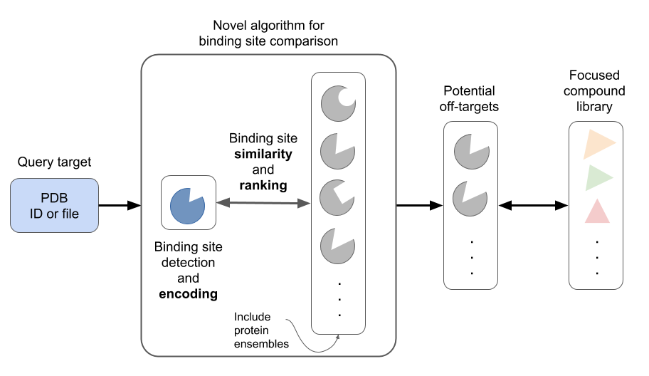

# `ratar` &mdash; Read-across the targetome

[//]: # (Badges)
[](https://github.com/volkamerlab/ratar/actions?query=workflow%3ACI)
[](https://opensource.org/licenses/MIT)
[](https://zenodo.org/badge/latestdoi/187793388)

> :construction: This repository is in early stages of developement. The current API is not stable.

## Project descripition

**Read-across the targetome &mdash; an integrated structure- and ligand-based workbench for computational target prediction and novel tool compound design**



How to probe and validate a potential pathway or target remains one of the key questions in basic research in life sciences. Often these investigations lack suitable chemical tool compounds for the elucidation of the function of a specific protein. Therefore, large consortia, like the Structural Genomics Consortium, have formed to generate tool compounds for the validation of biological targets via classical chemical synthesis and extensive protein structure determination efforts. While these consortia will continue with their focused experimental approaches, the `ratar` project will offer a computational solution for the generation of a comprehensive set of tool compounds for novel targets. 

The project hypothesis is based on the similarity principle (similar pockets bind similar compounds) with the ultimate goal of using protein pocket similarity to extrapolate compound information from one target to another.

1. Protein structures will be collected from the PDB. For all structures per protein, potential pockets will be identified and clustered to ensemble pockets. 
2. Novel efficient structure-based binding site comparison algorithm will be developed to find the most similar pockets considering protein flexibility in terms of ensembles. This `ratar` repository holds an initial implementation for this step.
3. Ligand and binding data will be extracted from ChEMBL, filtered and assigned to the respective pockets. Using the novel algorithm, ligands known to bind to the detected neighboring pockets can be elucidated. These compounds can be selected as chemical probes for functional annotations or as novel focused compound libraries for virtual screening. 

## Installation

> We are assuming you have a working ``mamba`` installation in your computer. If this is not the case, please refer to their [official documentation](https://mamba.readthedocs.io/en/latest/installation.html#mamba). 
> If you installed ``mamba`` into an existing ``conda`` installation, also make sure that the ``conda-forge`` channel is configured by running ``conda config --add channels conda-forge``.

1. Download `ratar` repository

    ```
    git clone git@github.com:volkamerlab/ratar.git
    ```
2. Create a new conda environment called ``ratar-dev``:

    ```
    mamba env create -f ratar/devtools/conda-envs/test_env.yaml -n ratar-dev
    ```

3. Activate the new conda environment:

    ```
    conda activate ratar-dev
    ```

4. Install ``ratar`` package via pip:

    ```
    pip install -e ratar
    ```

5. Test that your installation works::

    ```
    ratar -h
    ```

## Usage

### CLI

1. Encode binding sites from mol2 files (pdb files not working currently); save them as pickle files to disc (replace pickle save with e.g. csv save in the future).

    ```
    ratar encode -i input.mol2 -o .
    ```

2. Compare structures. CLI is set up without implementation (add functionality in `ratar/ratar/cli.py`'s `main_compare` function.)

    ```
    ratar compare
    ```

### Python API

See [tutorial](https://github.com/volkamerlab/ratar/blob/master/docs/tutorials/ratar_tutorial.ipynb) for details on the current Python API of `ratar`.


## Copyright

Copyright (c) 2019, Volkamer Lab


## Acknowledgements
 
Project based on the 
[Computational Molecular Science Python Cookiecutter](https://github.com/molssi/cookiecutter-cms) version 1.0.
